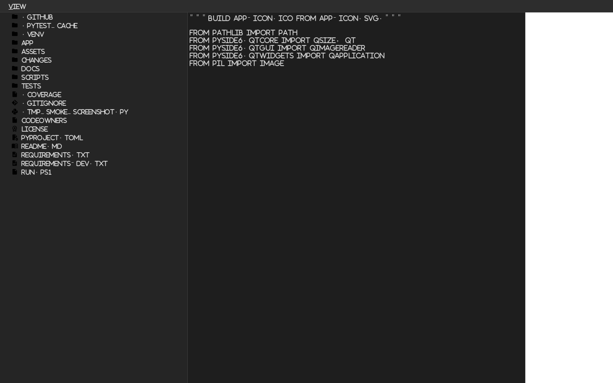
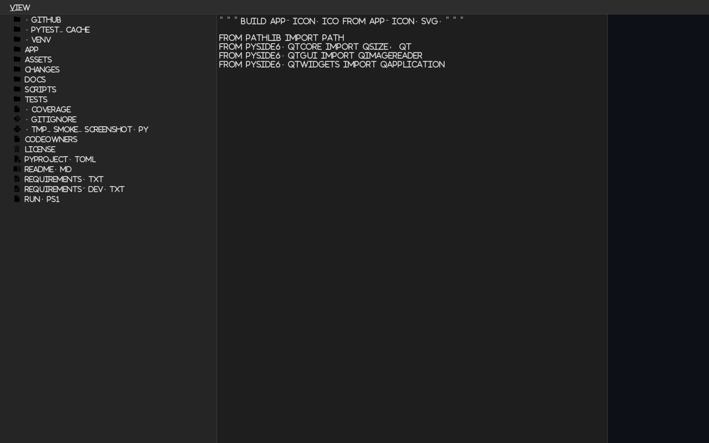

# ArchExplorer AI

> **Análise, visualização e geração de arquitetura de software — tudo num IDE desktop, tudo offline, tudo no seu PC.**

<p align="center">
  
  <br>
  <em>Janela principal — Explorer, Editor, Visualizer com resposta da IA em PT-BR</em>
</p>

<p align="center">
  <a href="https://github.com/Rick-Henrique7/ArchExplorer-AI/actions">
    
  </a>
  <a href="./LICENSE">
    
  </a>
  <a href="https://github.com/Rick-Henrique7/ArchExplorer-AI/releases">
    
  </a>
  <a href="#testes">
    
  </a>
  <a href="#testes">
    
  </a>
  <a href="https://www.python.org/">
    
  </a>
  <a href="https://doc.qt.io/qtforpython-6/">
    
  </a>
  <a href="https://ollama.com/library/qwen2.5-coder">
    
  </a>
  <a href="#quickstart">
    
  </a>
  <a href="https://github.com/Rick-Henrique7/ArchExplorer-AI">
    
  </a>
</p>

<p align="center">
  <a href="#quickstart"><strong>Começar agora</strong></a>
  ·
  <a href="#arquitetura"><strong>Arquitetura</strong></a>
  ·
  <a href="#testes"><strong>Testes</strong></a>
  ·
  <a href="#workflow-de-desenvolvimento"><strong>Workflow</strong></a>
  ·
  <a href="https://github.com/Rick-Henrique7/ArchExplorer-AI/issues">Issues</a>
</p>

---

## Screenshots

<p align="center">
  
  &nbsp;&nbsp;
  
</p>

<p align="center">
  <em>Esquerda: arquivo aberto no editor + análise renderizada no visualizer (markdown + Mermaid).<br>
  Direita: estado idle aguardando o usuário clicar em <b>Analisar</b>.</em>
</p>

> **Adicionando mais screenshots:** basta dropar um arquivo `.png` em
> [`assets/`](./assets) e referenciar aqui com ``.
> Tamanho recomendado: **1280×800 px** (a janela padrão do app).

---

## Proposta

O **ArchExplorer AI** é uma ferramenta desktop de produtividade para
engenheiros de software. Combina um **IDE leve de 3 colunas** (estilo
VS Code) com um **LLM local** (Qwen 2.5 Coder via Ollama) para
ajudar a entender, documentar e melhorar a arquitetura de qualquer
projeto, sem mandar o seu código pra nenhuma API na nuvem.

A interface imita o layout de um IDE clássico:

```
┌────────────┬────────────────┬──────────────────────────────────────┐
│            │                │  Arquivo: app/main.py    [Analisar]  │
│  EXPLORER  │     EDITOR     │ ┌────────────────────────────────┐   │
│   (árvore  │   (código,     │ │  ## Padrões                     │   │
│   de       │    editável,   │ │  - Singleton via QSettings      │   │
│   arquivos)│    Salvar/     │ │                                  │   │
│            │    Editar com  │ │  ```mermaid                      │   │
│  [+Pasta]  │    IA)         │ │  classDiagram                    │   │
│  [Atualiz] │                │ │  ```                             │   │
│            │                │ └────────────────────────────────┘   │
│            │                │ ──────────────────────────────────  │
│            │                │ ┌─ chat com a IA (PT-BR) ─────────┐  │
│            │                │ │ ▢ pergunta aqui…        [Enviar]│  │
└────────────┴────────────────┴──────────────────────────────────────┘
   esquerda          centro                     direita
```

### Para quem é

- **Engenheiros sênior** entrando num projeto novo e querendo um mapa
  rápido de padrões, acoplamentos e vazamentos de responsabilidade.
- **Tech leads** revisando PRs e precisando de uma segunda opinião
  sobre a estrutura de um módulo.
- **Estudantes** estudando código real (open source, projetos da
  faculdade) e querendo a IA apontar o que vale a pena ler primeiro.
- **Qualquer pessoa** que valoriza **privacidade** — todo o
  processamento é local; nenhum byte do seu código sai da máquina.

### O que ele faz hoje

- 📁 **Explorador de arquivos** com ícones Material Design por extensão
  (Python, TS, JS, Java, MD, JSON, configs) e seleção de pasta arbitrária.
- ✏️ **Editor editável** com Salvar (Ctrl+S) e "Editar com IA" (preview
  com diff unificado antes de aplicar).
- 🤖 **Análise sob demanda** (botão **Analisar**) que envia o arquivo
  para o Qwen 2.5 Coder 3B local e devolve markdown estruturado
  (Padrões / Problemas / Sugestões) + diagrama Mermaid renderizado.
- 💬 **Chat livre** com a IA sobre o arquivo aberto, com histórico
  (LRU 50 turnos) e contexto do código embutido no prompt.
- 🧠 **Cache de análises** por arquivo (SHA-1 do conteúdo) — voltar
  num arquivo que você já analisou é instantâneo.
- 💾 **Persistência** da pasta raiz entre execuções (QSettings/registro
  no Windows).
- 🎨 **Tema dark/light/system** com `Ctrl+Shift+T` para alternar; todos
  os ícones e o markdown seguem o tema.

### O que ele **não** faz (e por quê)

- **Não roda na nuvem.** Privacidade por design — todo o pipeline é
  offline (Ollama local, Qwen 2.5 Coder 3B quantizado).
- **Não faz autocomplete de código** (Copilot-style). É focado em
  *entender e melhorar arquitetura*, não em gerar código inline.
- **Não abre projetos muito grandes** num único clique. O `FileInspector`
  recusa arquivos > 1 MB e tipos binários — a análise de IA
  funciona melhor em unidades coesas (uma classe, um módulo).

---

## Arquitetura

```
╔══════════════════════════════════════════════════════════════════════════╗
║                          ArchExplorer AI                                ║
║                  Desktop · Offline · Local LLM · pt-BR                  ║
╚══════════════════════════════════════════════════════════════════════════╝

  ┌─────────────────┐   pick   ┌─────────────────┐  edit   ┌──────────────────────────────────┐
  │   EXPLORER (1)  │────────▶ │    EDITOR (2)   │────────▶│         VISUALIZER (3)           │
  │                 │          │                 │         │                                  │
  │  QFileSystemMod │          │  QPlainTextEdit │         │  ┌─ Header: "Arquivo: foo.py"    │
  │  + MDI icons    │          │  + toolbar      │         │  │   [+ Analisar]                 │
  │  + toolbar      │          │  ┌───────────┐  │         │  ├─ QWebEngineView (Mermaid)    │
  │    [+Pasta]     │          │  │ Salvar    │  │         │  │   (markdown render)            │
  │    [Atualizar]  │          │  │ Edit c/IA │  │         │  └─ Chat input + histórico       │
  │    [Sel. Pasta] │          │  └───────────┘  │         │      (PT-BR · LRU 50)           │
  └─────────────────┘          └─────────────────┘         │                                  │
           │                              │                │  + Cache (LRU 32, SHA-1 key)    │
           │                              │                │  + QSettings (root persistence) │
           │                              │                └──────────────┬───────────────────┘
           │                              │                               │
           ▼                              ▼                               │ signals (cross-thread)
  ┌──────────────────────────────────────────────────────────────────────┐ │
  │                          SERVICES LAYER                              │ │
  │                                                                      │ │
  │  ┌────────────────┐  ┌────────────────┐  ┌────────────────────────┐  │ │
  │  │  FileManager   │  │   AIEngine     │  │   FileInspector        │  │ │
  │  │                │  │                │  │                        │  │ │
  │  │  • list / read │  │  • analyze_    │  │  • whitelist (.py,     │  │ │
  │  │  • create_     │  │    architecture│  │    .ts, .tsx, .js,     │  │ │
  │  │    file/folder │  │  • edit_file   │  │    .jsx, .java, .json, │  │ │
  │  │  • write_file  │  │  • extract_uml │  │    .md, .txt)          │  │ │
  │  │  • clipboard   │  │  • chat (free) │  │  • UTF-8 strict        │  │ │
  │  │  • copy / cut  │  │                │  │  • 1 MiB max           │  │ │
  │  │  • move / del  │  │  SYSTEM_PROMPT │  │                        │  │ │
  │  └────────────────┘  │  (pt-BR + "vê"  │  └────────────────────────┘  │ │
  │                      │   o arquivo")   │                              │ │
  │                      └────────┬───────┘                              │ │
  │                               │                                      │ │
  │                               ▼                                      │ │
  │                      ┌────────────────┐                              │ │
  │                      │ OllamaProvider │                              │ │
  │                      │  (HTTP client) │                              │ │
  │                      │  timeout 300s  │                              │ │
  │                      └────────┬───────┘                              │ │
  └───────────────────────────────┼──────────────────────────────────────┘ │
                                  │ QRunnable / QThreadPool              │
                                  ▼                                       │
                       ┌────────────────────────────────┐                │
                       │           WORKERS              │                │
                       │  (QRunnable + _WorkerSignals)  │                │
                       │                                │                │
                       │  ┌────────────┐ ┌────────────┐  │                │
                       │  │ Analysis   │ │  AIEdit    │  │                │
                       │  │ Worker     │ │  Worker    │  │                │
                       │  │ (análise)  │ │ (preview)  │  │                │
                       │  └────────────┘ └────────────┘  │                │
                       │  ┌────────────┐                 │                │
                       │  │  Chat      │                 │                │
                       │  │  Worker    │                 │                │
                       │  │ (prompt    │                 │                │
                       │  │  livre)    │                 │                │
                       │  └────────────┘                 │                │
                       └────────────────┬───────────────┘                │
                                        │                                │
                                        │ POST /api/generate             │
                                        │ { prompt, system, options }    │
                                        ▼                                │
                          ┌────────────────────────────┐                │
                          │   Ollama (localhost)       │                │
                          │   qwen2.5-coder:3b         │                │
                          │   (1.9 GB, GPU/CPU)         │                │
                          └────────────────────────────┘                │
                                                                       │
   ┌──────────────────────────────────────────────────────────────────┘
   │
   ▼
  rendered markdown + Mermaid
  back to the user
```

### Fluxo de uma análise de arquivo

```
1. User clica no arquivo no EXPLORER
   └─▶ FileExplorerPanel.file_selected.emit(path)
2. MainWindow._on_file_selected(path)
   └─▶ inspect_file(path)  ── ext ok? utf-8 ok? ≤ 1 MB?
       └─▶ CodeEditorPanel.set_content(text, path, file_type)
           └─▶ VisualizerPanel.set_file_context(path, text)
           └─▶ VisualizerPanel.set_current_file(path)  [enable Analisar]
           └─▶ cache hit? ─sim─▶ VisualizerPanel.show_cached(md)  [fim]
                              ─não─▶ VisualizerPanel.show_idle()

3. User clica [Analisar]
   └─▶ VisualizerPanel.analyze_requested.emit()
4. MainWindow._on_analyze_requested()
   └─▶ cache miss? ─sim─▶ AnalysisWorker(ai_engine, content, file_type)
                          └─▶ ai_engine.analyze_architecture(content, type)
                              └─▶ OllamaProvider.generate(prompt, system, t=0.2)
                          └─▶ signals.finished(md)
       └─▶ MainWindow._on_analysis_finished(md)
           └─▶ cache[path] = (sha1, md)
           └─▶ VisualizerPanel.show_markdown(md)
```

---

## Quickstart

### Pré-requisitos

- **Python 3.10+** (3.13 testado) — qualquer sistema operacional.
- **Ollama** instalado e rodando localmente (porta `11434`).
- ~2 GB de disco para o modelo `qwen2.5-coder:3b`.

### Setup do Ollama

```bash
# 1. Instale o Ollama (https://ollama.com)
# 2. Baixe o modelo (uma vez, ~1.9 GB)
ollama pull qwen2.5-coder:3b
# 3. Verifique se está rodando
curl http://localhost:11434
```

### Setup do app (Windows PowerShell)

> **Importante no Windows:** o launcher `py` é registrado globalmente e
> ignora o venv ativo. Depois de ativar o venv, use **`python`** (não
> `py`) para rodar o app. O `run.ps1` encapsula a ativação pra você
> não ter que lembrar.

```powershell
# Opção A — script one-shot (recomendado)
.\run.ps1

# Opção B — passo a passo
py -m venv .venv
.\.venv\Scripts\Activate.ps1
python -m pip install --upgrade pip
python -m pip install -r requirements-dev.txt
python -m app.main
```

### Setup do app (Linux / macOS)

```bash
python3 -m venv .venv
source .venv/bin/activate
pip install --upgrade pip
pip install -r requirements-dev.txt
python -m app.main
```

Uma janela chamada **ArchExplorer AI** vai abrir com os 3 painéis.
Clique em qualquer arquivo do projeto aberto, depois clique em
**Analisar** no canto superior direito do painel de visualização.

---

## Stack

| Camada         | Tecnologia                                     | Por quê                                                |
|----------------|------------------------------------------------|--------------------------------------------------------|
| GUI            | **PySide6** (Qt 6.8+)                          | LGPL, nativo, sem GIL, bindings Python de qualidade     |
| Ícones         | **qtawesome 1.4** + Material Design Icons      | Vetoriais, temáticos, sem assets binários              |
| HTTP           | **requests 2.32**                              | Padrão de fato, sync + fácil de mockar                 |
| LLM            | **Qwen 2.5 Coder 3B** via **Ollama**           | Offline, bom em PT, leve o suficiente pra CPU          |
| Markdown       | **marked 11.1.1** (via CDN)                    | Confiável, manutenção ativa                            |
| Diagramas      | **Mermaid.js 10.9.1** (via CDN)                | Padrão de fato pra UML/flowchart dentro de HTML        |
| Diff           | **difflib** (stdlib)                           | Sem dependência extra, qualidade suficiente            |
| Testes         | **pytest 8** + pytest-cov + requests-mock      | Padrão Python, cobertura rica                          |

---

## Testes

```powershell
# Suite completa
python -m pytest

# Só unitários com cobertura
python -m pytest tests/unit --cov=app

# Um arquivo específico
python -m pytest tests/unit/test_ai_engine.py -v
```

**Estado atual:** `334 passed, 2 skipped` (os 2 skipped são testes
live que precisam do Ollama rodando).

**Cobertura:** 86% global, com 100% nos workers e nos dialogs.

```
Name                                Stmts   Miss  Cover
-------------------------------------------------------
app\ui\analysis_worker.py              57      0   100%
app\ui\ai_edit_preview.py              46      0   100%
app\ui\code_editor.py                  86      1    99%
app\services\ai_engine.py              71      1    99%
app\services\diagram_generator.py      41      1    98%
app\ui\file_explorer.py               114      8    93%
app\ui\visualizer.py                  192     16    92%
app\ui\theme.py                        65      7    89%
app\ui\file_inspector.py               36      4    89%
app\services\file_manager.py          138     18    87%
-------------------------------------------------------
TOTAL                                1163    166    86%
```

---

## Workflow de desenvolvimento

Este projeto usa **Spec-Driven Development (SDD)** em cima de
**trunk-based development**. Cada mudança (feature, fix, refactor) é
uma pasta em [`changes/`](./changes) com quatro artefatos:

```
changes/NNN-name/
├── proposal.md   # PORQUÊ — o problema, alternativas, decisão
├── spec.md       # O QUÊ — comportamento observável + critérios de aceite
├── design.md     # COMO — decisões de arquitetura, trade-offs, diagramas
└── tasks.md      # CHECKLIST — tarefas executáveis com [x]
```

Após merge via PR, a pasta vai pra `changes/archive/` num commit
`chore: archive change NNN`.

**Trunk-based:** branch curta `00X-name` → PR → squash → merge em `main`
→ archive. Tudo via [conventional commits](https://www.conventionalcommits.org/).

### Histórico de mudanças

| Change | Título | Status |
|--------|--------|--------|
| [001](./changes/archive/001-pyside6-skeleton) | Skeleton PySide6 + 3 painéis | ✅ shipped |
| [002](./changes/archive/002-services-layer) | Camada de serviços (FileManager, AIEngine, DiagramGenerator) | ✅ shipped |
| [003](./changes/archive/003-ui-integration-rendering) | Integração UI + render markdown/Mermaid | ✅ shipped |
| [004](./changes/archive/004-icons-and-theme) | Ícones MDI + dark/light/system | ✅ shipped |
| [005](./changes/archive/005-interactive-features) | Chat, Salvar, Editar com IA, toolbar, padding | ✅ shipped |
| 006+   | (em planejamento — cache de análises, system prompt PT-BR, analise manual, etc.) | 🔄 próximo |

---

## Documentação

- [`docs/visão-geral.md`](./docs/vis%C3%A3o-geral.md) — visão geral
  do projeto, personas, casos de uso.
- [`docs/frontend/front.md`](./docs/frontend/front.md) — spec do frontend
  (widgets, fluxos, shortcuts).
- [`docs/backend/backend.md`](./docs/backend/backend.md) — spec do
  backend e serviços internos (FileManager, AIEngine, workers).
- [`docs/testing/testing-strategy.md`](./docs/testing/testing-strategy.md) —
  estratégia de testes e padrões do pytest.
- [`docs/guidelines/diretriz.md`](./docs/guidelines/diretriz.md) —
  princípios SOLID e de design aplicados.

---

## Roadmap

- [x] Cache de análises por arquivo
- [x] Análise manual (botão dedicado) em vez de auto-trigger
- [x] PT-BR forçado via system prompt
- [x] Contraste de ícones no tema claro
- [ ] Syntax highlight no editor (Pygments ou QsciScintilla)
- [ ] Streaming de resposta da IA (mostra tokens chegando)
- [ ] Persistência da posição dos splitters
- [ ] Múltiplas abas de chat (uma por arquivo)
- [ ] Export de análise (markdown standalone + Mermaid SVG)
- [ ] Suporte a outros modelos (DeepSeek Coder, CodeLlama, etc.)

---

## Contribuindo

Issues e PRs são bem-vindos. Antes de abrir um PR grande:

1. Abra uma issue descrevendo o problema / feature.
2. Espere um maintainer aprovar a abordagem.
3. Siga o workflow SDD: crie `changes/00X-name/` com os 4 artefatos.
4. Use commits convencionais (`feat:`, `fix:`, `refactor:`, `docs:`,
   `test:`, `chore:`).
5. Garanta `pytest` verde antes do push.

---

## Licença

**Apache 2.0** — veja [`LICENSE`](./LICENSE) para o texto completo.

Copyright 2026 Henrique Moraes dos Santos.

---

## Agradecimentos

- **Qt Project** pelo PySide6 (LGPL).
- **Sam Hocevar** e colaboradores pelo qtawesome.
- **Alibaba** pelo Qwen 2.5 Coder (Apache 2.0).
- **Ollama** por tornar LLMs locais trivialmente fáceis.
- **Knut Sveidqvist** e colaboradores pelo Mermaid.js.
- **Toda a comunidade Python** que mantém o ecossistema de testes
  (`pytest`, `requests-mock`, `pytest-cov`) que este projeto usa.

> "Escrever software bom é 10% inspiração e 90% debug." — *qualquer dev*
